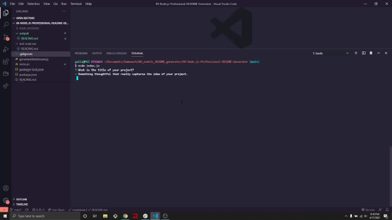

# 09 Node.js Homework: Professional README Generator

## Description

The purpose of this application is to create a professional README file from the command line to allow the project creator to devote more time to the other components of the project.

## Table of Contents
- [Description](#description)
- [Installation](#installation)
- [Usage](#usage)
- [License](#license)
- [Contributors](#contributors)
- [Tests](#tests)
- [Questions](#questions)
- [Contact](#contact)

## Installation

At the time of making this generator, it can only be made by copying the files to the project. 

## Usage

In order to use this project, one must download the [Inquirer package](https://www.npmjs.com/package/inquirer).

Then open the terminal from the root of the files and type in "node index.js", then answer the questions to the best of your abilities. 

After all the questions have been answered the README will be generated to the output folder where it can be edited further. 

## License

Source link for [MIT](https://opensource.org/licenses/MIT)

## Contributors

Cody Gallagher

## Tests

There are no tests at this time.

For a full video demonstrations [click here](https://drive.google.com/file/d/1VuqFeSDHQCS7UkQ1BFfmTaVFfE4ZGuDL/view?usp=sharing).

## Questions

I would like to know how to integrate this into a browser modal for users ho aren't comfortable with terminals. 

## Contact

[GitHub Profile](https://github.com/CodyG-2021)

[Email Me](gallagher2021@gmail.com)

